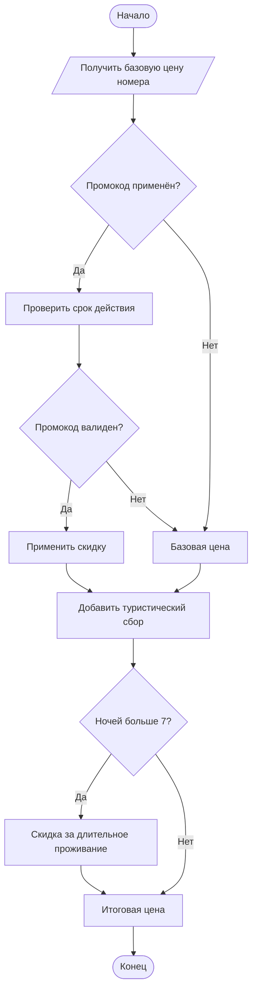

# Блок-схема: Расчёт стоимости бронирования

```mermaid
flowchart TD
    A([Начало]) --> B[/Получить базовую цену номера/]
    B --> C{Промокод применён?}
    C -- Да --> D[Проверить срок действия]
    C -- Нет --> E[Базовая цена]
    D --> F{Промокод валиден?}
    F -- Да --> G[Применить скидку]
    F -- Нет --> E
    G --> H[Добавить туристический сбор]
    E --> H
    H --> I{Ночей больше 7?}
    I -- Да --> J[Скидка за длительное проживание]
    I -- Нет --> K[Итоговая цена]
    J --> K
    K --> L([Конец])
```
