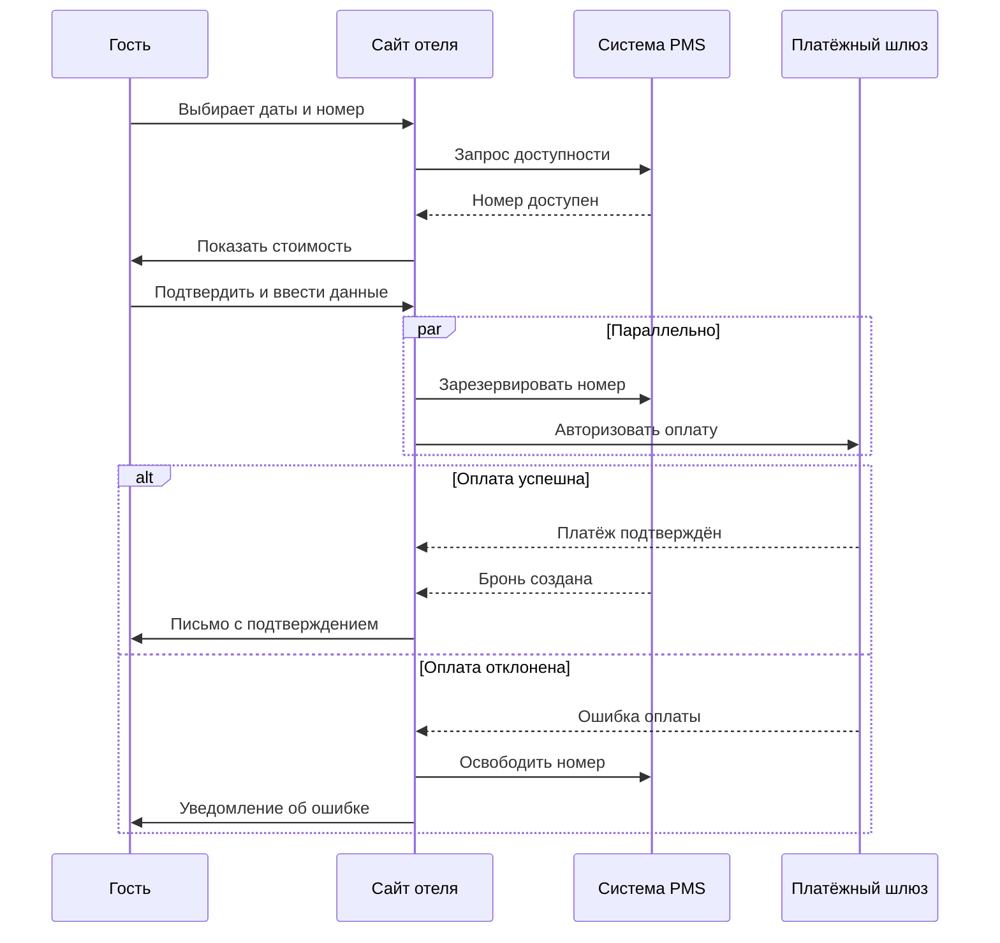

# Диаграмма последовательности: Бронирование номера в отеле

```mermaid
sequenceDiagram
    participant G as Гость
    participant W as Сайт отеля
    participant P as Система PMS
    participant Pay as Платёжный шлюз

    G->>W: Выбирает даты и номер
    W->>P: Запрос доступности
    P-->>W: Номер доступен
    W->>G: Показать стоимость
    G->>W: Подтвердить и ввести данные

    par Параллельно
        W->>P: Зарезервировать номер
        W->>Pay: Авторизовать оплату
    end

    alt Оплата успешна
        Pay-->>W: Платёж подтверждён
        P-->>W: Бронь создана
        W->>G: Письмо с подтверждением
    else Оплата отклонена
        Pay-->>W: Ошибка оплаты
        W->>P: Освободить номер
        W->>G: Уведомление об ошибке
    end
```
