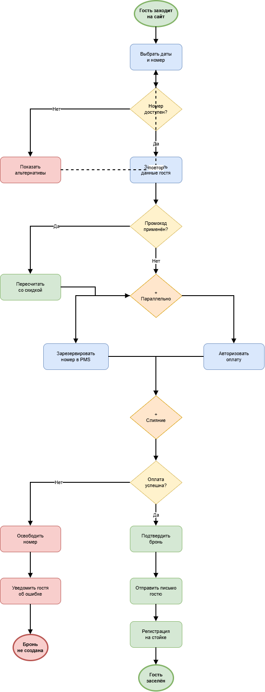
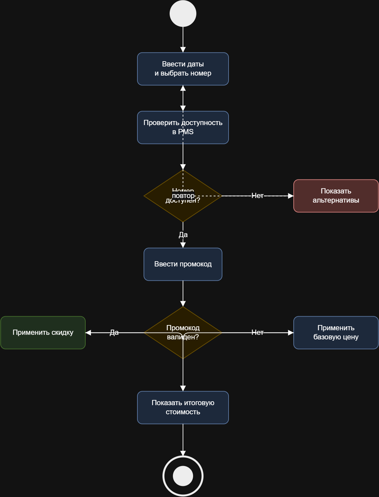

# Лабораторная работа №1

**Моделирование процессов с использованием Git и визуальных нотаций**

| | |
|---|---|
| **Тема процесса** | Бронирование номера в отеле |
| **Репозиторий** | visual-programming-labs-Kliucnik- |
| **Дисциплина** | Технологии визуального программирования |

---

## 1. Краткое описание процесса

Процесс описывает онлайн-бронирование номера в отеле, включая проверку доступности, применение промокода, параллельное резервирование и оплату.

**Участники (роли):** Гость, Сайт отеля, Система PMS, Платёжный шлюз.

**Шаги процесса:**

1. Гость заходит на сайт отеля и выбирает даты заезда и выезда.
2. Система показывает список доступных номеров с ценами.
3. Гость выбирает подходящий номер.
4. Если номер недоступен — система предлагает альтернативы; иначе — продолжает.
5. Гость заполняет контактные данные.
6. Если применён промокод — система пересчитывает стоимость со скидкой.
7. Параллельно: система резервирует номер в PMS, платёжный шлюз авторизует оплату.
8. Если оплата прошла — бронь подтверждается; иначе — номер освобождается, гость получает уведомление.
9. Система отправляет письмо с подтверждением.
10. Гость прибывает в отель, администратор находит бронь и регистрирует гостя.

**Полное описание:** [docs/process_description.md](docs/process_description.md)

---

## 2. Диаграммы

### 2.1. BPMN-диаграмма



- **Изображение (PNG):** [diagrams/process-bpmn.png](diagrams/process-bpmn.png)
- **Исходный файл:** [diagrams/process.bpmn](diagrams/process.bpmn)
- **Элементы:** стартовое событие, 11 задач, 5 шлюзов (3 исключающих XOR + 2 параллельных AND), 2 конечных события
- **Ветвления (XOR):** «Номер доступен?», «Промокод применён?», «Оплата успешна?»
- **Параллельные действия:** «Зарезервировать номер в PMS» и «Авторизовать оплату» выполняются одновременно (шлюзы AND)

### 2.2. UML Activity Diagram



- **Изображение (PNG):** [diagrams/activity-uml.png](diagrams/activity-uml.png)
- **Исходный файл:** [diagrams/activity.drawio](diagrams/activity.drawio)
- **Детализирует шаг:** «Проверка доступности номера и применение промокода»
- **Элементы:** начальный узел, 6 действий, 2 решения (ромбы), конечный узел
- **Цикл:** при отсутствии номера поток возвращается обратно к выбору дат

### 2.3. Sequence Diagram (Mermaid)

- **Исходный файл:** [docs/sequence.md](docs/sequence.md)
- **4 участника** (lifelines), **10 сообщений**, **1 блок alt** (ветвление по оплате), **1 блок par** (параллельные действия)

### 2.4. Flowchart (Mermaid)

- **Исходный файл:** [docs/flowchart.md](docs/flowchart.md)
- **Алгоритм:** расчёт итоговой стоимости бронирования
- **Условия ветвления:** применение промокода, длительность проживания (скидка за >7 ночей)

## 3. Работа с Git, сравнение текстовых и бинарных форматов (git diff)

Чтобы увидеть разницу, были внесены небольшие изменения в диаграмму и выполнен git diff:

```bash
git diff HEAD~1 -- lab1/diagrams/process.bpmn
git diff HEAD~1 -- lab1/diagrams/process-bpmn.png
Результат:

Формат	Тип	Как Git показывает изменения
.bpmn (XML)	текстовый	Построчно: видно добавленные/изменённые строки (+/−), можно прочитать, что именно поменялось
.drawio (XML)	текстовый	Построчно: видно новую фигуру и связи
.md (Mermaid)	текстовый	Построчно: видно каждое добавленное сообщение/шаг
.png	бинарный	Только Binary files a/... and b/... differ — без деталей
Вывод: текстовые исходники диаграмм (BPMN XML, .drawio, Mermaid) удобно версионировать — изменения читаемы и осмысленны в истории. Бинарные PNG для сравнения версий практически бесполезны: Git видит только факт изменения файла.

5. Выводы
В ходе работы я освоила базовые команды Git (add, commit, push) и работу с GitHub через веб-интерфейс. Научилась создавать диаграммы в нотациях BPMN (в bpmn.io и draw.io), UML Activity (в draw.io), а также использовать Mermaid для диаграмм последовательности и блок-схем.

На практике убедилась, что текстовые форматы диаграмм удобнее использовать, чем бинарные: в git diff для .bpmn видно конкретные строки, а для .png — только факт того, что файл изменился. Это объясняет, почему важно хранить в репозитории исходники диаграмм вместе с их PNG-экспортами.


