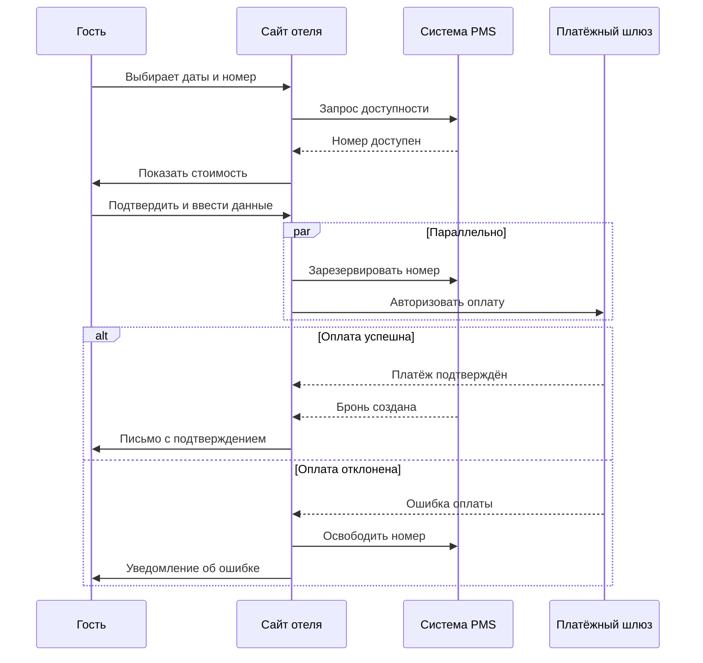
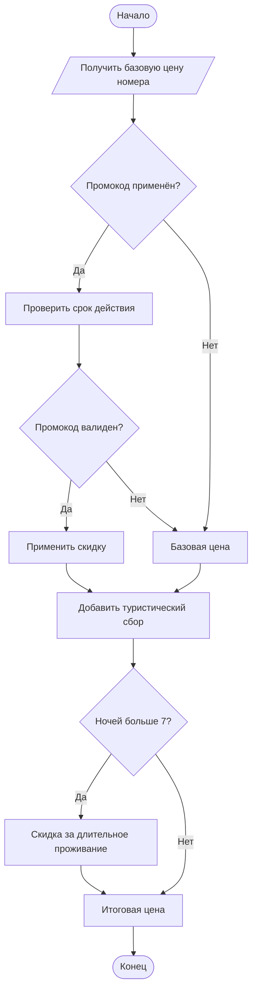

# Лабораторная работа №1

**Моделирование процессов с использованием Git и визуальных нотаций**

| | |
|---|---|
| **Тема процесса** | Бронирование номера в отеле |
| **Репозиторий** | visual-programming-labs-Kliucnik- |
| **Дисциплина** | Технологии визуального программирования |

---

## 1. Краткое описание процесса

Процесс описывает онлайн-бронирование номера в отеле: проверку доступности, применение промокода, параллельное резервирование и оплату.

**Участники:** Гость, Сайт отеля, Система PMS, Платёжный шлюз.

**Полное описание:** [docs/process_description.md](docs/process_description.md)

---

## 2. Диаграммы

### 2.1. BPMN-диаграмма

- **Исходник:** [diagrams/process.bpmn](diagrams/process.bpmn)
- **Элементы:** стартовое событие, 11 задач, 3 XOR + 2 AND шлюза, 2 конечных события

### 2.2. UML Activity Diagram

- **Исходник:** [diagrams/activity.drawio](diagrams/activity.drawio)
- **Детализирует шаг:** проверка доступности номера и применение промокода

### 2.3. Sequence Diagram

- **Исходник:** [docs/sequence.md](docs/sequence.md)

### 2.4. Flowchart

- **Исходник:** [docs/flowchart.md](docs/flowchart.md)

---

## 3. Сравнение текстовых и бинарных форматов (git diff)

| Формат | Тип | Как Git показывает изменения |
|---|---|---|
| `.bpmn` (XML) | текстовый | Построчно: видно добавленные/удалённые строки |
| `.drawio` (XML) | текстовый | Построчно: видно новую фигуру и связи |
| `.md` (Mermaid) | текстовый | Построчно: видно каждое добавленное сообщение |
| `.png` | бинарный | Только `Binary files ... differ` — без деталей |

**Вывод:** текстовые исходники удобно версионировать — изменения читаемы. Бинарные PNG для сравнения версий почти бесполезны.

---

## 4. Выводы

В ходе работы я освоила базовые команды Git и работу с GitHub. Научилась создавать диаграммы в нотациях BPMN, UML Activity и Mermaid. Убедилась, что текстовые форматы диаграмм удобнее для версионирования, чем бинарные.
